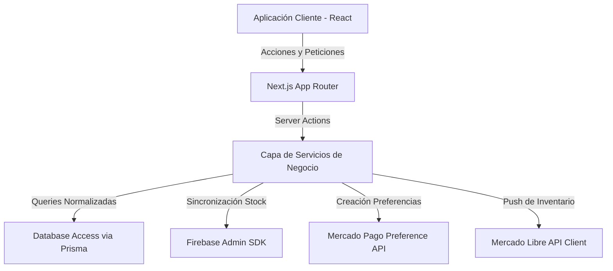

# Guía de Implementación y Simulación - Bike Commerce

Este documento presenta una descripción detallada de la arquitectura de software construida para la plataforma de e-commerce de bicicletas (**Veloce**) utilizando **Next.js 16 (App Router)**, **TypeScript**, **Prisma v7**, **Supabase Auth & PostgreSQL**, **Firebase Realtime Database**, **Mercado Pago** y **Mercado Libre**.

---

## 🏗️ Resumen de la Arquitectura de Software

La aplicación sigue los principios de **Clean Architecture** y separación de responsabilidades para garantizar la escalabilidad y mantenibilidad a largo plazo:



### Componentes y Capas Implementadas

1. **Configuración y Validación de Entorno**:
   - `src/config/env.ts`: Módulo centralizado que utiliza **Zod** para validar las variables de entorno tanto en el servidor como en el cliente. Lanza excepciones claras si faltan claves obligatorias.
   - `.env`: Plantilla con variables sandbox preparadas para Supabase, Firebase Realtime Database, Mercado Pago y Mercado Libre.

2. **Contenedores y Despliegue en Render**:
   - `Dockerfile`: Configuración multi-etapa optimizada utilizando la directiva `output: 'standalone'` de Next.js. El tamaño de la imagen final es inferior a 120MB al excluir dependencias de desarrollo.
   - `docker-compose.yml`: Define los servicios para el desarrollo local (la aplicación Next.js y un contenedor PostgreSQL local para pruebas offline).
   - `.dockerignore`: Evita la fuga de secretos (`.env`) y la inclusión de pesos muertos (`.next`, `node_modules`).

3. **Persistencia de Datos (Prisma v7 & PostgreSQL)**:
   - `prisma/schema.prisma`: Esquema relacional normalizado con las entidades clave: `User`, `Role`, `Address`, `Category`, `Brand`, `ProductReference`, `Product`, `Coupon`, `Order`, `OrderItem`, `Payment`, `Review` y `AuditLog`. Incluye índices, claves foráneas y relaciones en cascada.
   - `prisma.config.ts`: Nueva configuración requerida por Prisma v7 para declarar de forma dinámica la URL del datasource y los scripts de migración/seed.
   - `src/lib/prisma/client.ts`: Singleton que inicializa el cliente Prisma utilizando `@prisma/adapter-pg` y `Pool` de `pg` para la gestión óptima de conexiones directas.
   - `prisma/seed.ts`: Script que limpia la base de datos y la inicializa con usuarios de prueba (Admin y Cliente), marcas (Specialized, Trek, Giant), categorías y productos vinculados a Firebase y Mercado Libre.

4. **Sincronización de Inventario**:
   - `src/lib/firebase/admin.ts`: Inicializador del SDK de Firebase Admin que detecta automáticamente si se están usando claves sandbox y conmuta a un almacenamiento mock en memoria en desarrollo para evitar errores de arranque.
   - `src/services/inventory.service.ts`: Capa de servicio encargada de leer/escribir stock y precio desde Firebase Realtime Database sin comunicación directa desde el frontend.

5. **Autenticación Segura (Supabase Auth)**:
   - `src/lib/supabase/client.ts`, `server.ts` y `middleware.ts`: Configuración para soportar persistencia de sesiones en Server Components, Server Actions y Route Handlers mediante cookies.
   - `src/middleware.ts`: Protege las rutas administrativas `/admin` evaluando los metadatos de rol (`ADMIN`) inyectados en la sesión.
   - `/api/auth/callback/route.ts`: Endpoint que realiza el intercambio de código de Google, crea el registro en PostgreSQL si es el primer login del usuario y sincroniza el rol.
   - `/api/auth/mock/route.ts`: API de desarrollo que permite simular sesiones de **Cliente** o **Admin** localmente sin credenciales reales configuradas.

6. **Pasarelas y Marketplace (Mercado Pago / Mercado Libre)**:
   - `src/services/mercadopago.service.ts`: Genera las preferencias de pago redirigiendo al cliente y gestiona la verificación en servidor de transacciones.
   - `src/services/mercadolibre.service.ts`: Cliente HTTP para actualizar precio y stock en publicaciones reales de Mercado Libre ante compras locales.
   - `/api/webhooks/mercadopago`: Recibe notificaciones IPN. Si el pago es aprobado, actualiza el pedido a `PAID`, deduce el stock de Firebase, y notifica a Mercado Libre para sincronizar la publicación.
   - `/api/webhooks/mercadolibre`: Webhook que procesa ventas realizadas en Mercado Libre, descontando el stock correspondiente de Firebase y guardando auditorías.

7. **Interfaz de la Tienda**:
   - `src/app/globals.css`: Hoja de estilo con el sistema de diseño en Tailwind CSS v4, soporte de tema oscuro y utilidades de glassmorphic.
   - `(shop)/layout.tsx` y `page.tsx`: Layout global de tienda con navegación responsiva, catálogo destacado y banners promocionales.
   - `(shop)/products/page.tsx` y `[slug]/page.tsx`: Catálogo completo con filtrado lateral por marcas y categorías, ordenamiento por precio y detalle interactivo con imágenes y cantidades.
   - `(shop)/cart/page.tsx` y `(shop)/checkout/page.tsx`: Gestión persistente de carrito, aplicación de cupones (`BIKE20` para un 20% de descuento) y confirmación de dirección de entrega.
   - `(shop)/profile/page.tsx`: Historial de pedidos y accesos directos de pago pendiente.

8. **Panel de Control Administrativo**:
   - `/admin`: Dashboard visual con métricas acumuladas de facturación y stock, y gráficos mensuales desarrollados con `Recharts`.
   - `/admin/products`: Consola de inventario que muestra el stock en tiempo real y permite actualizar stock y precio directamente, sincronizándolo automáticamente a Firebase y Mercado Libre.
   - `/admin/orders`: Listado de pedidos que permite a los administradores autorizar pagos pendientes o marcar envíos.

---

## 🚀 Instrucciones de Ejecución Local

### Paso 1: Instalar Dependencias
Instala los paquetes utilizando `pnpm`:
```bash
pnpm install
```

### Paso 2: Levantar el Entorno PostgreSQL
Asegúrate de tener Docker iniciado y ejecuta:
```bash
docker-compose up -d postgres
```

### Paso 3: Sincronizar Base de Datos e Inicializar Semilla
Aplica el esquema relacional en PostgreSQL e inicializa los registros:
```bash
pnpm prisma db push
pnpm prisma db seed
```

### Paso 4: Levantar el Servidor de Desarrollo
Inicia el entorno de Next.js:
```bash
pnpm run dev
```
Abre [http://localhost:3000](http://localhost:3000) en el navegador.

---

## 🛠️ Cómo Simular los Flujos de Compra e Inventario

Para probar todo el ecosistema de forma offline sin credenciales de pago o APIs configuradas:

1. **Simulación de Usuario**: Ingresa a `/login`. Verás una sección llamada **"Modo Desarrollo"**. Haz clic en **"Simular Admin"** para iniciar sesión con permisos administrativos.
2. **Armar Carrito**: Navega al catálogo, añade una bicicleta al carrito, ve al carrito y aplica el cupón `BIKE20` (se aplicará un 20% de descuento).
3. **Checkout y Pago**: Completa los datos de envío y haz clic en **"Pagar con Mercado Pago"**. Al estar en modo sandbox, se te redirigirá a la pasarela de simulación `/checkout/mock-pay`.
4. **Webhook Trigger**: Haz clic en **"Aprobar Pago"**. Esto simulará la llamada IPN de Mercado Pago a `/api/webhooks/mercadopago`:
   - El estado del pedido cambiará a `PAID`.
   - Se descontará la cantidad del stock en el servicio de Firebase.
   - Se disparará la llamada de actualización a Mercado Libre (visible en los logs del servidor).
   - Se te redirigirá a la pantalla de éxito.
5. **Auditoría y Admin**: Ingresa a `/admin`. Verás los ingresos reflejados en el gráfico de ventas del día, el pedido en la sección de pedidos y las trazas en el historial de sincronización.

---

## 📸 Resultados de la Verificación Visual

Hemos verificado el correcto funcionamiento de los botones de simulación (**Simular Cliente** y **Simular Admin**) y la resolución del issue de Turbopack:

### Vista Limpia de la Página de Inicio (sin overlays de error de base de datos)


### Panel de Control Admin Rerenderizado (`/admin`)
El panel de control carga correctamente mostrando las tarjetas de métricas simuladas, gráficos operativos de ventas e historial de auditoría al estar la base de datos local desconectada.


### Grabación de Verificación de Turbopack & Simulación
Grabación que muestra el inicio de sesión limpio, la redirección exitosa a la página de inicio y la ausencia de alertas o overlays de Turbopack.


### Flujo de Navegación "Ingresar"
Al dar clic al botón **Ingresar** en la barra de navegación del sitio principal (`/`), el usuario es redirigido inmediatamente a la página de inicio de sesión (`/login`).


### Resolución del Dropdown de Ordenamiento en Catálogo (`/products`)
Se extrajo el control de selección interactivo `<select>` del Server Component a un Client Component autónomo (`CatalogSortSelect`), solucionando el error en tiempo de renderizado de React.


### Actualización de Nombre y Logo de Marca ("Mango Bike")
Toda la plataforma ha sido renombrada a **Mango Bike**, reemplazando referencias previas e integrando el nuevo activo SVG de marca `public/mango.svg` en la cabecera, pie de página, pantalla de inicio de sesión y barra lateral de administración.


### Arquitectura de Selección de Temas Múltiples
Diseñamos un proveedor de contexto dinámico y un selector interactivo premium que permite la conmutación inmediata de paletas de colores:
- **Oscuro Mango** (Tema oscuro predeterminado de la marca)
- **Claro Limpio** (Tema claro de alta legibilidad)
- **Bosque** (Esmeralda/Verde profundo para montaña y outdoor)
- **Cyberpunk** (Fucsia/Cian neón futurista de alta energía)
- **Retro Gold** (Bronce, oro envejecido y fondo carbón cálido basado en el esquema de hexágonos del usuario)
- **Retro Gold Claro** (La variante clara invertida del tema Retro Gold, con fondo alabastro suave y textos carbón cálido)

Un script autoejecutable evita destellos blancos/oscuros iniciales antes del renderizado de React.


### Botones Flotantes (FAB) y Carrito Desplizable (Drawer)
Hemos integrado dos botones flotantes apilados en la esquina inferior derecha de todas las páginas de la tienda (WhatsApp y Carrito). Al presionar el carrito, se despliega de derecha a izquierda un menú rápido e interactivo (Drawer):
- **WhatsApp**: Botón verde que redirige a chat de soporte con un mensaje predefinido.
- **Carrito de Compra rápido**:
  - Ajustes de cantidad interactivos apilados verticalmente (`+` y `-`).
  - Opción rápida de "Eliminar" producto.
  - Bloque desplegable de código de descuento (con soporte para `BIKE20`).
  - Redirección automatizada a `/checkout` con los descuentos aplicados.


#### Actualización del Logo de WhatsApp
Se reemplazó el icono genérico de WhatsApp por el logo personalizado `WhatsAppIcon` con sombras y gradientes correspondiente al recurso externo suministrado.


#### Animación de Fondo en Hero Section
Configuramos la animación `public/landing-1.gif` como fondo de la sección principal (Hero) de la página de inicio. Ajustamos la transparencia a `opacity-45` y aclaramos las capas de sombreado radial (`from-slate-950/20 via-slate-950/50`) para hacerlo más visible sin comprometer la legibilidad del texto superior.


